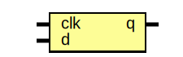
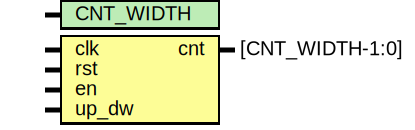
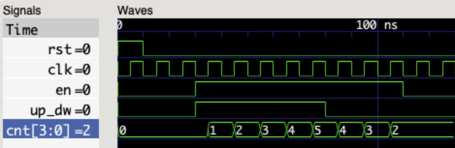
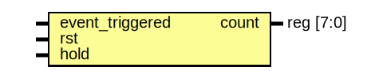

# Labwork Report - Lesson 2

# 1. D flipflop

- **File**: [dff.sv](./rtl/dff.sv)
## Diagram


## Ports

| Port name | Direction | Type | Description                                        |
| --------- | --------- | ---- | -------------------------------------------------- |
| clk       | input     |      | Clock signal                                       |
| d         | input     |      | Data to be stored on positive edge triggered clock |
| q         | output    |      | Current state of the D flip flop                   |

# 2, 3. Up/Down counter (4 bit)

- **File**: [up_dw_cnt.sv](./rtl/up_dw_cnt.sv)
## Diagram


## Generics

| Generic name | Type | Value | Description              |
| ------------ | ---- | ----- | ------------------------ |
| CNT_WIDTH    |      | 4     | Bit width of the counter |
## Ports

| Port name | Direction | Type            | Description                    |
| --------- | --------- | --------------- | ------------------------------ |
| clk       | input     |                 | Clock signal                   |
| rst       | input     |                 | Reset the counter              |
| en        | input     |                 | enable counter                 |
| up_dw     | input     |                 | Up/Down (1 for Up, 0 for Down) |
| cnt       | output    | [CNT_WIDTH-1:0] | Current count value            |


## Test

- **File**: [up_dw_cnt_tb.sv](./tb/up_dw_cnt_tb.sv)

#### Waveform



The testbench enabled the Up/Down counter module to count up 5 times, then down 3 times, before finally disabling it. The behavior confirmed that the module works as expected.

---
---
---

# Homework Report - Lesson 2

# 3. Event counter

- **File**: [event_counter.sv](./rtl/event_counter.sv)
## Diagram


## Ports

| Port name       | Direction | Type      | Description                                          |
| --------------- | --------- | --------- | ---------------------------------------------------- |
| event_triggered | input     |           | Event occurred, increment the count                  |
| rst             | input     |           | Reset the count to zero                              |
| hold            | input     |           | Hold the current count even if an event is triggered |
| count           | output    | reg [7:0] | Count the number of events that have occurred        |

## Test

- **File**: [event_counter_tb.sv](./tb/event_counter_tb.sv)

#### Waveform:


Whenever the _event_triggered_ signal occurs, the counter value _count_ is incremented by one. However, when the _hold_ signal is high, the counter stops incrementing, even if _event_triggered_ occurs. At the end of the waveform, we can observe the reset signal _rst_, which resets the counter to zero.


# 4. Adder 4 bit with overflow bit check

- **File**: [adder4b.sv](./rtl/adder4b.sv)
## Diagram


## Ports

| Port name | Direction | Type  | Description                 |
| --------- | --------- | ----- | --------------------------- |
| a         | input     | [3:0] | Input value _a_ to be added |
| b         | input     | [3:0] | Input value _b_ to be added |
| s         | output    | [3:0] | Output sum _s = a + b_      |
| o         | output    |       | Overflow bit                |

## Test

- **File**: [adder4b_tb.sv](./tb/adder4b_tb.sv)

#### Output:

```
 4 +  1 =  5  
 9 +  3 = 12  
13 + 13 = 10 [OVERFLOWED]
 5 +  2 =  7  
 1 + 13 = 14  
 6 + 13 =  3 [OVERFLOWED]
13 + 12 =  9 [OVERFLOWED]
 9 +  6 = 15  
 5 + 10 = 15  
 5 +  7 = 12  
```

#### Waveform:


The testbench was run with 10 randomized values for each of the _a_ and _b_ inputs. The sum _s = a + b_ and the overflow bit _o_ worked as expected.