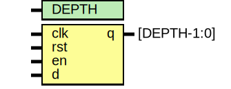
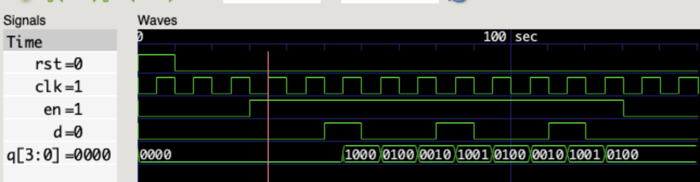

# Labwork Report - Lesson 2

# Lab 1 & 6. D flipflop

- **File**: [dff.sv](./rtl/dff.sv)
## Diagram

## Generics

| Generic name | Type | Value | Description |
| ------------ | ---- | ----- | ----------- |
| DATA_WIDTH   |      | 1     |             |

## Ports

| Port name | Direction | Type             | Description                                        |
| --------- | --------- | ---------------- | -------------------------------------------------- |
| clk       | input     |                  | Clock signal                                       |
| d         | input     | [DATA_WIDTH-1:0] | Data to be stored on positive edge triggered clock |
| q         | output    | [DATA_WIDTH-1:0] | Current state of the D flip flop                   |

# Lab 2, 3, and 4. Up/Down counter (4 bit)

- **File**: [up_dw_cnt.sv](./rtl/up_dw_cnt.sv)
## Diagram

## Generics

| Generic name | Type | Value | Description              |
| ------------ | ---- | ----- | ------------------------ |
| CNT_WIDTH    |      | 4     | Bit width of the counter |
## Ports

| Port name | Direction | Type            | Description                    |
| --------- | --------- | --------------- | ------------------------------ |
| clk       | input     |                 | Clock signal                   |
| rst       | input     |                 | Reset the counter              |
| en        | input     |                 | enable counter                 |
| up_dw     | input     |                 | Up/Down (1 for Up, 0 for Down) |
| cnt       | output    | [CNT_WIDTH-1:0] | Current count value            |

## Test

- **File**: [up_dw_cnt_tb.sv](./tb/up_dw_cnt_tb.sv)

#### Waveform

The testbench enabled the Up/Down counter module to count up 5 times, then down 3 times, before finally disabling it. The behavior confirmed that the module works as expected.

# Lab 5. Shift register

- **File**: [shift_reg.sv](./rtl/shift_reg.sv)
## Diagram

## Generics

| Generic name | Type | Value | Description                 |
| ------------ | ---- | ----- | --------------------------- |
| DEPTH        |      | 4     | Depth of the shift register |
## Ports

| Port name | Direction | Type        | Description                                           |
| --------- | --------- | ----------- | ----------------------------------------------------- |
| clk       | input     |             | Clock signal to trigger data shift on rising edge     |
| rst       | input     |             | Reset signal to initialize the register to 0          |
| en        | input     |             | Enable signal to allow shifting when high             |
| d         | input     |             | Data input for the shift register                     |
| q         | output    | [DEPTH-1:0] | Output of the shift register holding the shifted data |

The testbench enables the shift register module to load a random bit sequence (_0010010010_). The state of the shift register, _q_, follows the sequence, with each bit shifting in one by one at every clock edge until the enable signal, _en_, goes low, at which point the shifting is disabled.
