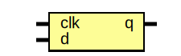
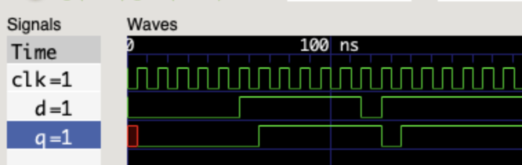

# Homework Report - Day 2

## D Flip-Flop

### Entity: dff 

- **File**: [dff.sv](./rtl/dff.sv)

### Diagram

### Ports

| Port Name | Direction | Type | Description                                       |
| --------- | --------- | ---- | ------------------------------------------------- |
| clk       | input     |      | Clock signal                                      |
| d         | input     |      | Data to be stored on the next clock edge          |
| q         | output    |      | Current state and the output of the D Flip-Flop   |

### Testbench

- **File**: [dff_tb.sv](./tb/dff_tb.sv)

The testbench was run with 10 randomized values for the _d_ input. The _q_ output changed to reflect the previous _d_ value at every positive clock edge, as expected.